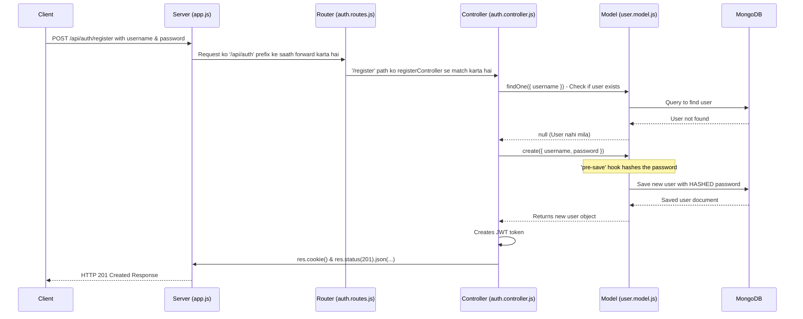

# Social Media Backend Project

This is a foundational backend for a social media application, built with Node.js, Express, and MongoDB. It features a complete, secure authentication system using JSON Web Tokens (JWT) and password hashing.

Yeh ek social media application ka backend hai, jo Node.js, Express, aur MongoDB use karke banaya gaya hai. Ismein ek complete aur secure authentication system hai jo JWT aur password hashing ka istemal karta hai.

---

## Core Technologies (Technology Stack)

*   **Node.js**: JavaScript runtime environment.
*   **Express.js**: Web application framework for Node.js.
*   **MongoDB**: NoSQL database to store user data.
*   **Mongoose**: Object Data Modeling (ODM) library for MongoDB and Node.js.
*   **JSON Web Token (JWT)**: For creating access tokens for authentication.
*   **bcryptjs**: For hashing passwords securely.
*   **dotenv**: For managing environment variables.
*   **cookie-parser**: For parsing cookies from requests.

---

## Project Setup (Project Ko Kaise Chalayein)

#### 1. Prerequisites (Zaruri चीजें)
Make sure you have Node.js and MongoDB installed on your system.
*Apke system mein Node.js aur MongoDB installed hona chahiye.*

#### 2. Installation

Clone the repository and install the dependencies.
*Repository ko clone karein aur dependencies install karein.*

```bash
# Install all the required packages from package.json
# package.json se saare packages install karein
npm install
```

#### 3. Environment Configuration (.env File)

Create a `.env` file in the root of the project and add the following variables.
*Project ke root folder mein ek `.env` file banayein aur yeh variables add karein.*

```env
# Your MongoDB connection string
# Aapka MongoDB connection string
MONGODB_URI=mongodb+srv://<user>:<password>@cluster.mongodb.net/yourDatabaseName

# A secret key for signing JWTs (make it long and random)
# JWT sign karne ke liye ek secret key (isko lamba aur random rakhein)
JWT_SECRET=THIS_IS_A_VERY_LONG_AND_RANDOM_SECRET_KEY
```

#### 4. Running the Server

Start the server using the following command. The server will automatically restart when you make changes to the code, thanks to `nodemon`.
*Server ko start karne ke liye neeche di gayi command use karein. `nodemon` ki wajah se, code change karne par server automatically restart ho jayega.*

```bash
npm start
```

---

## Project Structure (Folder Structure Kaisa Hai)

```
E:\AI COHORT\BACKEND\PROJECT 2 (SOCIAL MEDIA PROJECT)
│   .env
│   .gitignore
│   package-lock.json
│   package.json
│   README.md
│   server.js         # <-- Application ka entry point (Yahin se start hota hai)
│
└───src
    │   app.js          # <-- Express app configuration (Saare middleware yahin hain)
    │
    ├───controllers
    │       auth.controller.js  # <-- Business logic (Register/Login ka main code)
    │
    ├───db
    │       db.js         # <-- Database connection logic (MongoDB se connect hota hai)
    │
    ├───models
    │       user.model.js # <-- Mongoose schema/model (User ka data structure)
    │
    └───routes
            auth.routes.js      # <-- API routes (URL paths define karta hai)
```

---

## How It Works (Kaise Kaam Karta Hai)

### 1. Server Initialization (Server Start Hona)

1.  **`server.js`**: This is the first file that runs. It loads the environment variables from `.env` using `dotenv`.
    *   *Yeh sabse pehli file hai jo chalti hai. Yeh `dotenv` ki help se `.env` file se variables load karti hai.*
2.  **Database Connection**: It calls `connectToDB()` from `src/db/db.js` to establish a connection with the MongoDB database.
    *   *Yeh `connectToDB()` function ko call karke MongoDB se connection banata hai.*
3.  **Start Listening**: Finally, it starts the Express server on port 3000, which is defined in `src/app.js`.
    *   *Aakhir mein, yeh Express server ko port 3000 par start kar deta hai.*

### 2. Request-Response Flow (Ek Request Ka Safar)

When a client sends a request (e.g., to register a new user), it goes through several layers in our application.
*Jab client ek request bhejta hai (jaise naya user register karne ke liye), toh woh application ke kai layers se hokar guzarti hai.*



### 3. Authentication Logic (Register and Login)

#### Register (`registerController`)
1.  **Get Data**: It takes `username` and `password` from the request body (`req.body`).
2.  **Check Existence**: It checks in the database if a user with the same username already exists. If yes, it sends a `409 Conflict` error.
    *   *Database mein check karta hai ki user pehle se hai ya nahi. Agar hai, toh `409 Conflict` error bhejta hai.*
3.  **Create User**: If the user is new, it calls `userModel.create()`.
4.  **Password Hashing**: **(IMPORTANT)** Before the user is saved, the `pre-save` hook in `user.model.js` automatically hashes the plain-text password using `bcryptjs`. We never store the actual password.
    *   **(ZARURI)** User ko save karne se theek pehle, `user.model.js` mein likha `pre-save` hook password ko `bcryptjs` se hash kar deta hai. Hum asli password kabhi save nahi karte.
5.  **Create Token**: After the user is created, a JWT is generated containing the user's ID.
6.  **Send Response**: The token is set in a secure, `httpOnly` cookie, and a `201 Created` success message is sent back.

#### Login (`loginController`)
1.  **Get Data**: It takes `username` and `password` from `req.body`.
2.  **Find User**: It finds the user in the database by their username. If not found, it sends a `404 Not Found` error.
3.  **Verify Password**: It compares the password sent by the client with the hashed password stored in the database using `bcrypt.compare()`. This is a secure comparison.
    *   *Client se aaye password ko database mein stored hashed password se `bcrypt.compare()` use karke milata hai. Yeh ek secure tareeka hai.*
4.  **Create Token & Respond**: If the password is correct, it generates a new JWT, sets it in a cookie, and sends a `200 OK` success response.

### 4. Password Security with `bcryptjs`

Storing plain-text passwords is a huge security risk. We use hashing to protect them.
*Plain-text password store karna ek bohot bada security risk hai. Hum unhe protect karne ke liye hashing use karte hain.*

```mermaid
graph TD
    A[User enters password: "password123"] --> B{bcrypt.hash("password123", 10)};
    B --> C["Hashed Password: <br/>'$2a$10$K/B.x...long...random...string'"];
    C --> D[Store ONLY the HASH in MongoDB];
    D --> E{User tries to log in with "password123"};
    E --> F{bcrypt.compare("password123", storedHash)};
    F --> G[Returns `true` or `false`];
```

---

## API Endpoints

| Method | Route                | Description                                       |
| :----- | :------------------- | :------------------------------------------------ |
| `POST` | `/api/auth/register` | Registers a new user.                             |
| `POST` | `/api/auth/login`    | Logs in an existing user and returns a JWT cookie.|

---


```javascript
const createPostController = async (req, res) => {
    try {
        const { caption } = req.body;
        const userId = req.user._id; // from protectRoute middleware

        if (!req.file && !caption) {
            return res.status(400).json({ message: "Post must have either an image or a caption." });
        }

        let imageUrl = null;
        if (req.file) {
            // Convert image buffer to a Base64 Data URL
            const b64 = Buffer.from(req.file.buffer).toString("base64");
            imageUrl = `data:${req.file.mimetype};base64,${b64}`;
        }

        const newPost = new postModel({
            user: userId,
            caption: caption || '', // Ensure caption is not undefined
            Image: imageUrl
        });

        await newPost.save();

        res.status(201).json({ message: "Post created successfully", post: newPost });
    } catch (error) {
        console.error("Error creating post:", error);
        res.status(500).json({ message: "Internal server error", error: error.message });
    }
};